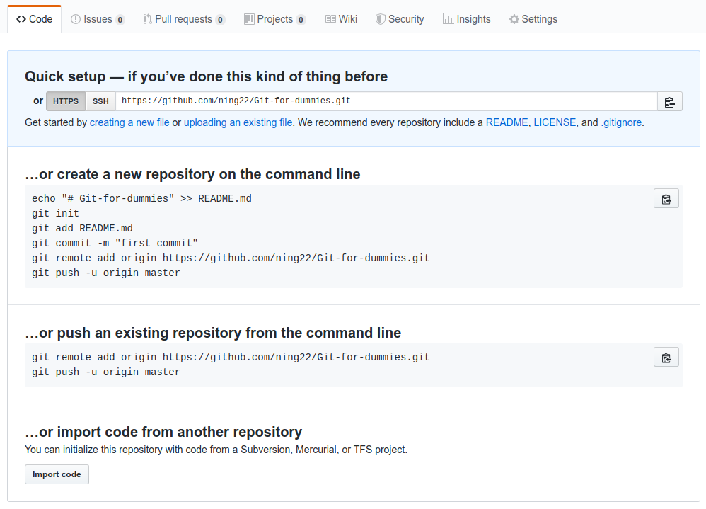

Demo:<br />
<br />

Helpful link to start git: <br />
https://git-scm.com/book/en/v2/Appendix-C%3A-Git-Commands-Getting-and-Creating-Projects

A simplified version of guide to start git: <br />
https://rogerdudler.github.io/git-guide/ <br />
http://hua-zhou.github.io/teaching/biostatm280-2019winter/slides/04-git/git


##  基本操作
```
git init 
git status 
git add $FILE # 將文件由工作區添加到暫存區 
git add -a 
git checkout # 暫存區的内容恢復到工作區
git commit -m [MESSAGE] # 文件由暫存區添加到倉庫區， -m后為提交説明 
git commit --amend - m [MESSAGE] # 替換上一次提交，如果代碼沒有變化，則用來改寫上一次commit的提交信息
git commit FILE1 FILE2 ... -m [MESSAGE] 
git commit --amend [FILE1] [FILE2] ...
git commit -v # 提交時，顯示所有diff信息
git log # 查看提交日志
git reset # 將代碼恢復到已經提交的某一個版本中 
git reset --hard $版本號 # 將代碼恢復到指定版本 
git reset --hard head~1 # 1:上一次提交，2：上上次提交，0：當前提交 
.gitinore # 文件名固定，不需要被git管理的文件路徑添加到其中 
```
## Branches
```
git branch # 列出所有本地分支
git branch --all # 列出所有本地分支和遠程分支， 當前分支前面會有*標記
git checkout [BRANCH NAME] # 切換分支，切換分支前需保證代碼已經提交
git checkout -b [BRANCH NAME] # 創建并切換分支
git checkout -d [BRANCH NAME] # 刪除分支,master分支可以刪除，但不推薦
git merge [BRANCH NAME] # 其他分支内容合并到當前分支，合并分支時，如果出現衝突，只能手動修改，再次提交
git cherry-pick [commit] # 選擇一個commit，合并進當前分支
git push origin --delete [BRANCH NAME] # 刪除遠程分支
git branch -dr [remote branch] # 刪除遠程分支
```
## Tag 
## 遠程倉庫相關命令
```
git push
git pull 
git clone 
git remote add $REP_NAME # 創建倉庫別名
git remote remove $REP_NAME

```
## Configuration of username and email 
```
git config user.name
git config user.email
git config --global user.name
git config --global user.email
git config --list
```


